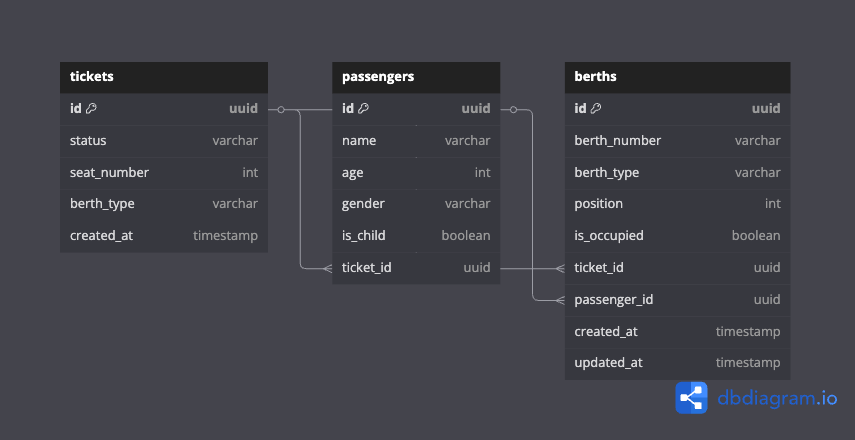

# 🚆 Railway Reservation System

A Node.js + Express backend for a smart **railway ticket reservation system** with support for:
- Booking confirmed, RAC, and waiting tickets
- Intelligent berth allocation (including children, elderly, women)
- Automatic promotion of passengers on cancellation
- Dockerized setup for easy deployment

---

## 🛠 Tech Stack

- Node.js + Express
- PostgreSQL
- Knex.js
- Docker + Docker Compose

---


## 📦 Environment Setup

Create a `.env` file in the project root:

```env
# .env
POSTGRES_USER=postgres
POSTGRES_PASSWORD=postgres
POSTGRES_DB=railway_db
DB_HOST=postgres
DB_PORT=5432
DB_NAME=railway_db
DB_USER=postgres
DB_PASSWORD=postgres
PORT=3000
```

## 🚀 Run Locally with Docker
Make sure you have Docker and Docker Compose installed.

### Build and start the service
```
docker-compose up --build
```
Note: To Run migrations and Seed data (berths and sample passengers)
I have added package.json scripts. While running compose --build, migrations and seeding can be run via compose only. Refer to docker-compose file

### 📮 API Usage (Sample Requests)
#### Book a Ticket

```
curl --location 'http://localhost:3000/api/v1/book' \
--header 'Content-Type: application/json' \
--data '{
  "passengers": [
    { "name": "Mark", "age": 24, "gender": "male" }
  ]
}'
```

Sample Response

```
{
  "message": "Ticket Booked (waiting)",
  "ticket_id": "5d7c230c-...",
  "passengers": [
    {
      "name": "Mark",
      "age": 24,
      "gender": "male",
      "is_child": false,
      "status": "waiting",
      "berth": "W10"
    }
  ]
}
```

#### Cancel a Ticket

```
curl --location --request POST 'http://localhost:3000/api/v1/cancel/<ticket_id>'
```
Sample Response

```
{
  "message": "Ticket cancelled and promotions (if any) completed.",
  "promoted": {
    "racToConfirmed": ["ef05..."],
    "waitingToRac": ["6358..."]
  }
}
```

#### Get All Booked Tickets

```
curl --location 'http://localhost:3000/api/v1/booked'
```

Sample Response

```
{
  "total": 1,
  "tickets": [
    {
      "ticket_id": "5506...",
      "status": "confirmed",
      "passengers": [
        {
          "id": "de37...",
          "name": "Alex",
          "age": 24,
          "gender": "male",
          "is_child": false,
          "berth_number": "C7",
          "berth_type": "upper"
        }
      ]
    }
  ]
}
```

#### Get Current Availability
```
curl --location 'http://localhost:3000/api/v1/available'
```
Sample Response
```
{
  "confirmed_left": 0,
  "rac_left": 0,
  "waiting_left": 1
}
```

### 🎥 Demo Video
👉 Booking Demo : [Booking](https://drive.google.com/file/d/1E0m6Wa38J0b1gQPecD2bFiR4uuHOVMIo/view?usp=drive_link)
👉 Cancellation Demo : [Cancellation](https://drive.google.com/file/d/1_pG0Wff1CFeVJp-04YTzRQb2NET0tdLj/view?usp=drive_link)


### 📌 Notes
Passengers under 5 are not allocated a berth.

Cancellations automatically trigger berth promotions in this order:

RAC → Confirmed

Waiting → RAC

Designed to handle concurrency with database transactions.


## Schema Design



[Schema Link to Visualise](https://dbdiagram.io/d/FreJun-Railway-Booking-Schema-68419ac3ba2a4ac57bff1856)

### **Entities:**

- **tickets:** A ticket groups passengers and has an overall status (`confirmed`, `rac`, `waiting`).
- **passengers:** Each passenger belongs to one ticket and might get a berth unless they're a child (age < 5).
- **berths:** Each physical seat or logical spot (RAC or waiting). Tracks which passenger is occupying it.

### **Relationships:**

- `ticket_id` in `passengers` → `tickets.id` (one-to-many)
- `ticket_id`, `passenger_id` in `berths` → respectively reference `tickets` and `passengers` (nullable, many-to-one)


🧑‍💻 Author
Rishabh Nagar
Feel free to reach out for any queries or suggestions.

